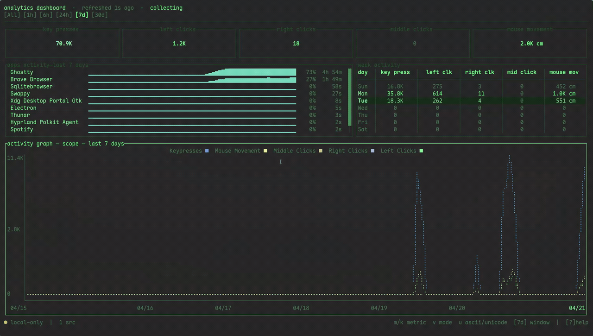

# Vigil

Vigil is a activity tracker for Linux and Windows to help you understand when you're most active, what do you do in active time and besides that, Vigil also create some cool stats. Vigil records keyboard activity, mouse movement, clicks, most used apps and save it all into a local SQLite database.

Find which part of the day, week or month that you was most active and in what did you spend your time on:



## Features

- Tracks key presses, mouse clicks (left/right/middle), mouse movement, and scroll
- Tracks focused window and active application over time
- Stores all data locally in SQLite — no cloud required
- Interactive terminal dashboard with charts, app activity, and weekly heatmaps
- Snapshot export and import for moving data between machines
- Optional feature-gated multi-device sync (`--features multi-sync`) so you can share data between multiple devices
- Linux and Windows startup mechanism.

---

## Installation

### From crates.io

```sh
cargo install vigil-rs
```

### Building from source

Build directly from source and get the latest commit:

```sh
git clone https://github.com/akamee666/vigil
cd vigil
cargo build --release
# Binary at: target/release/vigil
```

#### Nix

This repository ships a `flake.nix` with a development shell and build targets:

```bash
nix develop
nix build .#linux
nix build .#windows
```

Notes:

- `nix build .#linux` produces the native Linux package for the current host system
- `nix build .#windows` cross-compiles the Windows GNU binary from the current host system; it is not a native Windows build

---

## Commands

### `vigil collector`

> [!WARNING]
> On Linux, `life-monitor` reads raw input events from `/dev/input`. Your user usually needs permission to access those devices, add yourself to input group using `sudo usermod -aG input $USER` or run the program as `root`

Runs the background activity collector and handles all collector-related maintenance, it should keep running so your data keeps accurate.

```
vigil collector [OPTIONS]
```

**Collection options:**

| Flag                    | Default    | Description                                                         |
| ----------------------- | ---------- | ------------------------------------------------------------------- |
| `-i, --interval <SECS>` | 300        | How often buffered activity is flushed to SQLite                    |
| `-d, --debug`           | off        | Verbose logging; uses 5 s flush interval unless `--interval` is set |
| `-p, --dpi <DPI>`       | remembered | Mouse DPI used for estimating physical movement in cm               |

**Database options:**

| Flag               | Description                                                           |
| ------------------ | --------------------------------------------------------------------- |
| `--db-path <PATH>` | Use a custom database file or directory path (remembered across runs) |
| `-c, --clear`      | Delete the current database and start fresh                           |

**Import / Export:**

| Flag                    | Description                                                              |
| ----------------------- | ------------------------------------------------------------------------ |
| `--export-db <FILE>`    | Export a consistent SQLite snapshot to `<FILE>` and exit                 |
| `--import-db <FILE>`    | Import a previously exported snapshot and exit                           |
| `--dry-run`             | Preview import changes without writing anything (requires `--import-db`) |
| `--import-notes <TEXT>` | Attach notes to the import record (requires `--import-db`)               |

**Startup:**

| Flag                | Description                                     |
| ------------------- | ----------------------------------------------- |
| `--enable-startup`  | Configure Vigil to start automatically at login |
| `--disable-startup` | Remove the automatic startup entry              |

**Windows only:**

| Flag               | Description                  |
| ------------------ | ---------------------------- |
| `-s, --no-systray` | Disable the system tray icon |

---

### `vigil dashboard`

Opens the interactive read-only terminal dashboard. Does not start collection mechanism, it only shows existent data.

```sh
vigil dashboard
```

The dashboard shows:

- **Summary cards** — totals for the selected time window (key presses, clicks, mouse movement, active time)
- **App activity panel** — top applications by focus time with per-app activity histograms
- **Activity chart** — time series for the selected metric and time window
- **Week activity grid** — daily breakdown of activity by metric across recent days

---

## Dashboard Keybindings

| Key                    | Action                                            |
| ---------------------- | ------------------------------------------------- |
| `q` / `Esc`            | Quit (or close help modal)                        |
| `?` / `h`              | Open / close help                                 |
| `Tab` / `Shift-Tab`    | Cycle focus between panels                        |
| `1` / `2` / `3` / `4`  | Jump to: summary, apps, chart, weekly grid        |
| `[` / `]`              | Previous / next time window                       |
| `j` / `k` or `↑` / `↓` | Scroll / select rows in focused panel             |
| `m`                    | Next chart metric                                 |
| `v`                    | Toggle chart mode (single metric / scope overlay) |
| `r` / `F5`             | Reload data from SQLite                           |
| `u`                    | Toggle Unicode / ASCII rendering                  |

**Time windows:** `All`, `1h`, `6h`, `24h`, `7d`, `30d`

**Chart metrics:** activity score, key presses, left clicks, right clicks, middle clicks, mouse movement

---

## Mouse DPI

Vigil uses your mouse DPI to convert raw input counts into estimated centimeters of physical movement. On the first run without a remembered value, Vigil will prompt you to enter it.

To set or update it once it was set:

```sh
vigil collector --dpi 800
```

Vigil remembers this value across runs. I urge you to find how much DPI you're using otherwise mouse movement data will be incorrect.

---

## Custom Database Path

By default Vigil stores data at:

- **Linux:** `~/.local/share/vigil/data.db`
- **Windows:** `%LOCALAPPDATA%\vigil\data.db`

To use a different location:

```sh
vigil collector --db-path /mnt/nas/vigil/data.db
```

The path is remembered across runs. It can point to a file, a directory, or a mounted network share.

---

## Autostart Setup

### Enable

```sh
vigil collector --enable-startup
```

On **Linux**, an interactive picker lets you choose between:

- **XDG autostart** _(recommended)_ — creates a `.desktop` entry in `~/.config/autostart/`. Works with GNOME, KDE Plasma, Xfce, Cinnamon, LXQt, MATE, Budgie, and most mainstream desktop environments.
- **systemd user service** — installs a `vigil.service` unit under `~/.config/systemd/user/`. Appropriate for minimal or hand-configured sessions like i3, sway, Hyprland, bspwm, river, awesome, or dwm. If you're not sure if you have XDG configured properly in your setup, use this.

On **Windows**, a shortcut is created in `%APPDATA%\Microsoft\Windows\Start Menu\Programs\Startup`.

Both methods launch `vigil collector` at login.

### Disable

```sh
vigil collector --disable-startup
```

Removes the XDG autostart entry and/or systemd unit (Linux), or removes the Startup shortcut (Windows).

---

## Export and Import

### Export a snapshot

```sh
vigil collector --export-db ./snapshot.sqlite
```

Creates a consistent SQLite backup using SQLite backup primitives.

### Import a snapshot

```sh
# Preview changes before writing
vigil collector --import-db ./snapshot.sqlite --dry-run

# Apply the import
vigil collector --import-db ./snapshot.sqlite

# With notes
vigil collector --import-db ./snapshot.sqlite --import-notes "from laptop 2025-04"
```

Import is idempotent: re-importing the same snapshot does not double-count data. Each snapshot is identified by a unique export UUID to avoid duplicating data by mistake.

---

## BETA - Multi-Device Sync (optional)

Multi-device sync via a remote `sqld`/libSQL endpoint. This feature is useful when you have more than one system or computer and want to keep the data synced between them.

This feature is disabled by default and must be compiled in:

```sh
cargo build --features multi-sync
```

What you need:

- a reachable `sqld` / libSQL server
- the remote URL
- an auth token if your deployment requires one

Typical setup:

1. build `life-monitor` with `--features multi-sync`
2. run your `sqld` server somewhere you control
3. start `life-monitor` with `--sync-enable --sync-remote-url <URL>`
4. use `sync status` to confirm the local database is catching up

Important behavior:

- if the remote is unavailable, `life-monitor` keeps collecting locally
- pending sync work stays queued and is retried later
- local-only mode remains the default if you do not enable sync

After everything is set properly, you can use the `sync` commands:

```sh
vigil sync push
vigil sync pull
vigil sync status
```

Sync also runs in the background during collection:

```sh
vigil collector --sync-enable --sync-remote-url <URL> --sync-auth-token <TOKEN>
```

Or via environment variables:

```sh
VIGIL_SYNC_REMOTE_URL=<URL> VIGIL_SYNC_AUTH_TOKEN=<TOKEN> vigil collector --sync-enable
```

---

## Environment Variables

| Variable                   | Purpose                                                     |
| -------------------------- | ----------------------------------------------------------- |
| `VIGIL_DATA_DIR`           | Override the default data directory                         |
| `VIGIL_SKIP_INSTANCE_LOCK` | Set to `1` to skip the single-instance lock (testing only)  |
| `VIGIL_SYNC_REMOTE_URL`    | Remote sqld/libSQL endpoint for sync (`multi-sync` feature) |
| `VIGIL_SYNC_AUTH_TOKEN`    | Auth token for the sync remote (`multi-sync` feature)       |

---

## Why would I download a Spyware? - Contribuite

Well, I know. Vigil does seems like a spyware but I mean, the code is right there, you can check by yourself. Since I spend so much time on my computer, I just wanted to see cool graphs with data regarding my activity. Now you can too.

Feel free to contact me or create a PR if you want a new feature. Also, if you've found a bug, try to include:

- operating system
- desktop session type (`Wayland` or `X11`) on Linux
- relevant logs

---

## License

MIT
